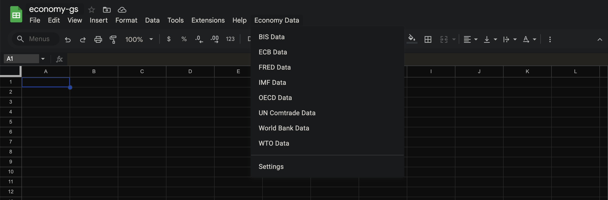
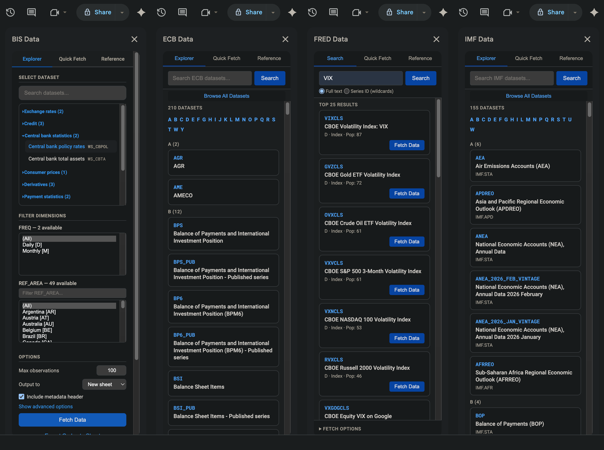
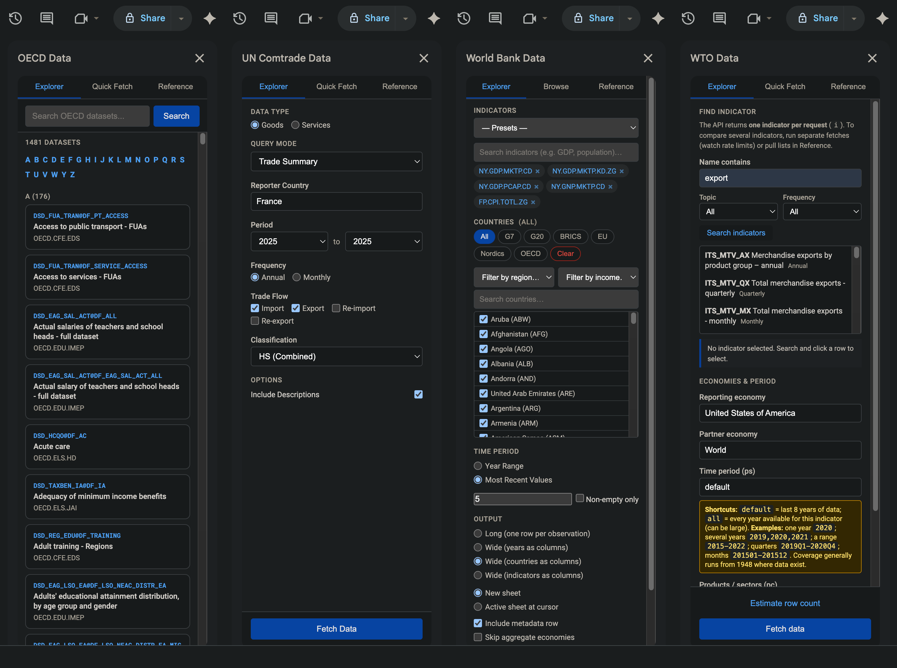

# Economy Data — Google Sheets Add-on

A unified **Google Sheets** add-on for fetching economic data from **8 international APIs** directly into a spreadsheet. Browse datasets, filter dimensions, run one-click presets, and analyse economic indicators inside Google Sheets.

## Supported APIs

| API                                                               | Description                                                     |
| ----------------------------------------------------------------- | --------------------------------------------------------------- |
| **BIS** (Bank for International Settlements)                      | Banking, derivatives, property prices, exchange rates, and more |
| **ECB** (European Central Bank)                                   | Euro area monetary & financial statistics via SDMX              |
| **FRED** (Federal Reserve Economic Data)                          | US macroeconomic data (CPI, GDP, interest rates, etc.)          |
| **IMF** (International Monetary Fund)                             | Global economic indicators via SDMX                             |
| **OECD** (Organisation for Economic Co-operation and Development) | Member-country economic data via SDMX                           |
| **UN Comtrade** (United Nations)                                  | International commodity trade statistics                        |
| **World Bank**                                                    | Global development indicators for 200+ countries                |
| **WTO** (World Trade Organization)                                | World trade timeseries data                                     |

## UI





## Installation

The add-on is deployed using [clasp](https://github.com/google/clasp) — the command-line interface for _Google Apps Script_.

### Prerequisites

- A Google account with access to [Google Sheets](https://sheets.google.com)
- [Node.js](https://nodejs.org/)

### Steps

```bash
# 1. Clone the repository
git clone <repository-url>
cd economy-gs

# 2. Install clasp globally
npm install -g @google/clasp

# 3. Log in to your Google account
clasp login

# 4. Push the source files to your Apps Script project
clasp push
```

Before pushing, rename the `mockup-clasp.json` as `.clasp.json`. Add **_parentId_** and **_scriptId_** from _Google Sheets_ and _Extensions → Apps Script_. The `.clasp.json` file defines `"rootDir": "src"`, so only files inside `src/` are pushed to Google Apps Script.

Open the linked Google Sheet and reload it. The **Economy Data** menu will appear in the menu bar. On first run, Google will prompt you to authorise the required permissions.

## Usage

The add-on creates an **Economy Data** menu in the Google Sheets menu bar with an entry for each API:

```
Economy Data
├── BIS Data
├── ECB Data
├── FRED Data
├── IMF Data
├── OECD Data
├── UN Comtrade Data
├── World Bank Data
├── WTO Data
└── Settings
```

Clicking any API item opens a **sidebar** dedicated to that data source. Every sidebar follows the same three-tab layout:

| Tab                      | Purpose                                                                                      |
| ------------------------ | -------------------------------------------------------------------------------------------- |
| **Explorer / Search**    | Search and browse datasets, select dimension filters, set time ranges, and fetch data        |
| **Quick Fetch / Browse** | One-click preset queries for popular indicators and datasets                                 |
| **Reference**            | In-app documentation, useful links, dataset lists, and (where applicable) API key management |

> **Note:** Google Sheets allows only one sidebar to be open at a time. Opening a new API sidebar will close the currently open one.

## API Keys

Three of the eight APIs require an API key. Keys can be set in the **Settings** dialog (Economy Data → Settings) or in each API's **Reference** tab within the sidebar.

| API         | Key Name           | Get a Key                                                                                      |
| ----------- | ------------------ | ---------------------------------------------------------------------------------------------- |
| FRED        | `FRED_API_KEY`     | [fred.stlouisfed.org/docs/api/api_key.html](https://fred.stlouisfed.org/docs/api/api_key.html) |
| UN Comtrade | `COMTRADE_API_KEY` | [comtradedeveloper.un.org](https://comtradedeveloper.un.org/)                                  |
| WTO         | `WTO_API_KEY`      | [apiportal.wto.org](https://apiportal.wto.org/)                                                |

Keys are stored securely in Google Apps Script's **Script Properties** and are never written to sheet cells.

## API Comparison

| API         | Data Type              | Key Required | Rate Limits  | Protocol      |
| ----------- | ---------------------- | :----------: | ------------ | ------------- |
| BIS         | Financial / banking    |      No      | Standard     | SDMX REST 2.0 |
| ECB         | Monetary / financial   |      No      | Standard     | SDMX REST 2.1 |
| FRED        | US macroeconomic       |     Yes      | 120 req/min  | REST JSON     |
| IMF         | Global macroeconomic   |      No      | Some limits  | SDMX REST 3.0 |
| OECD        | Economic / social      |      No      | 60 req/hour  | SDMX REST     |
| UN Comtrade | International trade    |     Yes      | Usage-based  | REST JSON     |
| World Bank  | Development indicators |      No      | None         | REST JSON     |
| WTO         | Trade timeseries       |     Yes      | Rate limited | REST JSON     |

## Custom Sheet Functions

### BIS Analytics Functions

| Function                                 | Description                                                        |
| ---------------------------------------- | ------------------------------------------------------------------ |
| `=BIS_GROWTH_RATE(range, periods)`       | Period-over-period growth rate (%). Default `periods = 1`          |
| `=BIS_MOVING_AVG(range, window)`         | Simple moving average over a rolling window                        |
| `=BIS_SUMMARY(range)`                    | Summary statistics: Count, Min, Max, Mean, Median, Std Dev         |
| `=BIS_YOY_CHANGE(range, periodsPerYear)` | Year-over-year change (%). Use `12` for monthly, `4` for quarterly |

### FRED Indicator Functions

| Function          | Description                                                          |
| ----------------- | -------------------------------------------------------------------- |
| `FRED_CPI()`      | Consumer Price Index                                                 |
| `FRED_GDP()`      | Real GDP                                                             |
| `FRED_UNRATE()`   | Unemployment Rate                                                    |
| `FRED_FEDFUNDS()` | Fed Funds Effective Rate                                             |
| `FRED_DGS10()`    | 10-Year Treasury Yield                                               |
| `FRED_SP500()`    | S&P 500                                                              |
| …                 | See [FRED documentation](./docs/FRED_README.md) for all 22 functions |

### World Bank Custom Functions

| Function                                     | Description                                    |
| -------------------------------------------- | ---------------------------------------------- |
| `=WB_DATA("SP.POP.TOTL", "USA", 2010, 2020)` | Time-series table for an indicator and country |
| `=WB_LATEST("NY.GDP.MKTP.CD", "FIN")`        | Most recent value for an indicator and country |
| `=WB_INDICATOR("SP.POP.TOTL")`               | Full name of an indicator from its code        |
| `=WB_COUNTRY("USA")`                         | Country name from its ISO3 code                |

## Per-API Documentation

Detailed documentation for each API integration is available in the [`docs/`](docs/) folder:

| API         | Documentation                                              |
| ----------- | ---------------------------------------------------------- |
| BIS         | [docs/BIS_README.md](./docs/BIS_README.md)                 |
| ECB         | [docs/ECB_README.md](./docs/ECB_README.md)                 |
| FRED        | [docs/FRED_README.md](./docs/FRED_README.md)               |
| IMF         | [docs/IMF_README.md](./docs/IMF_README.md)                 |
| OECD        | [docs/OECD_README.md](./docs/OECD_README.md)               |
| UN Comtrade | [docs/UN_COMTRADE_README.md](./docs/UN_COMTRADE_README.md) |
| World Bank  | [docs/WORLD_BANK_README.md](./docs/WORLD_BANK_README.md)   |
| WTO         | [docs/WTO_README.md](./docs/WTO_README.md)                 |

## Project Structure

All source files live in `src/` and follow a `PREFIX_filename` naming convention — the prefix identifies which API the file belongs to:

```
economy-gs/
├── .clasp.json                    # clasp deployment config
├── README.md                      # This file
├── docs/                          # Per-API documentation
│   ├── BIS_README.md
│   ├── ECB_README.md
│   ├── FRED_README.md
│   ├── IMF_README.md
│   ├── OECD_README.md
│   ├── UN_COMTRADE_README.md
│   ├── WORLD_BANK_README.md
│   └── WTO_README.md
├── notes/                         # Development notes
└── src/
    ├── appsscript.json            # Apps Script manifest
    ├── Code.gs                    # Entry point — menu, sidebar launchers
    ├── Settings.html              # Settings dialog (API keys)
    │
    ├── BIS_*.gs / .html           # BIS integration (9 files)
    ├── ECB_*.gs / .html           # ECB integration (7 files)
    ├── FRED_*.gs / .html          # FRED integration (3 files)
    ├── IMF_*.gs / .html           # IMF integration (7 files)
    ├── OECD_*.gs / .html          # OECD integration (7 files)
    ├── UN_COMTRADE_*.gs / .html   # UN Comtrade integration (7 files)
    ├── WORLD_BANK_*.gs / .html    # World Bank integration (8 files)
    └── WTO_*.gs / .html           # WTO integration (7 files)
```

Each API integration typically includes:

- `*_Api.gs` — HTTP client, caching, error handling
- `*_Data.gs` / `*_Parse.gs` — Data fetching and response parsing
- `*_Structure.gs` — Metadata: dataflows, dimensions, codelists
- `*_Quick.gs` — Quick Fetch preset definitions
- `*_Sheet.gs` / `*_SheetWriter.gs` — Google Sheets write operations
- `*_Sidebar.html` — Sidebar UI (HTML, CSS, JS)
- `*_Code.gs` — API-specific entry points (where needed)

## Notes

- **One sidebar at a time** — Google Sheets only allows a single sidebar to be open. Opening a different API's sidebar closes the current one.
- **Execution limits** — Google Apps Script has a 6-minute execution timeout. Use dimension filters and observation limits to keep large queries manageable.
- **Caching** — All integrations cache metadata (typically for 6 hours) to minimise API calls and speed up repeated queries.
- **Broken features** - If some feature is broken, it is most likely due to breaking changes in the APIs. The add-on will be updated infrequently, and the API descriptions will be checked and connections will be tested, when updates are made. Annual updates are planned.

## License

GNU GPLv3.

This project is not affiliated with or endorsed by any of the data providers listed above. Each API's data is subject to its respective terms of use.
